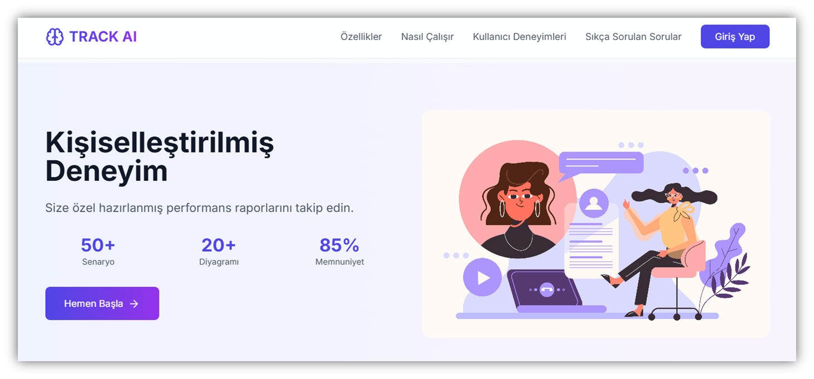
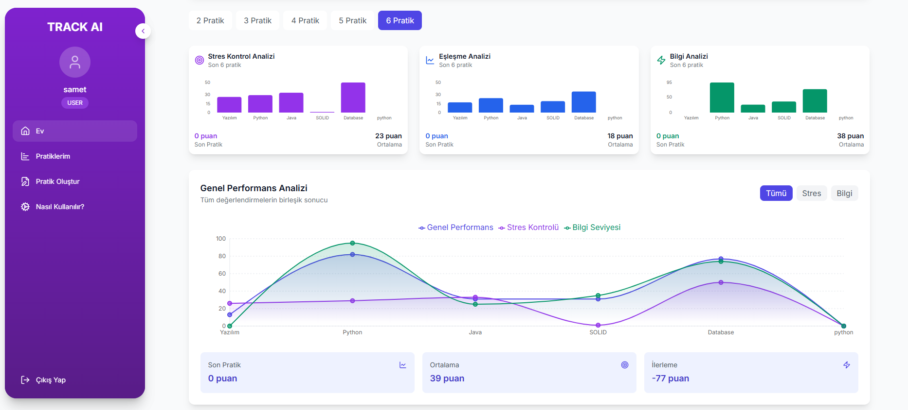

# TALENT_TRACK_AI

## Purpose

TalentTrack AI is an AI-powered pre-interview system designed to streamline recruitment processes and assess candidates' competencies objectively. By analyzing facial expressions and voice patterns, the system evaluates candidates' knowledge, emotional intelligence, and stress levels. This approach helps companies make informed hiring decisions while providing candidates with insights for personal development.

## Objectives

- **Emotion Analysis**: The system determines candidates' emotional states by analyzing facial expressions and voice tones.
- **Prototype Design and Development**: A user-friendly prototype was developed, featuring a simple interface that enables facial and voice data analysis during interviews.
- **Simulation Studies**: Simulations were conducted during development to evaluate and optimize the system's performance.
- **Experimental Setup**: Cameras and microphones were integrated as primary data collection tools, enabling real-time analysis and visualization.

## Features

1. **Facial and Voice Analysis**:
   - Emotion detection using OpenCV, Keras, and Wav2Vec2.
   - Speech-to-text conversion via Google Speech-to-Text API.

2. **Web Interface**:
   - Built with React.js for an intuitive user experience.

3. **Data Storage and Security**:
   - Analysis results and user data are securely stored using MongoDB.

4. **AI-Powered Evaluation**:
   - Leveraging ChatGPT for knowledge and emotion analysis.
   - Reports are generated in JSON format.

## Experimental Findings

- Real-time analysis of video and audio data achieved high accuracy in evaluating candidates' performance during pre-interviews.
- Analysis results, including stress levels, emotional states, and knowledge metrics, are visualized through a user-friendly interface.
- Performance reports provide clear insights into candidates' strengths and areas for improvement, facilitating both company decisions and personal development.

## Technology Stack

- **Frontend**: React.js
- **Backend**: Python (OpenCV, Keras, Wav2Vec2), Google Speech-to-Text API
- **Database**: MongoDB
- **AI Analysis**: ChatGPT

## How It Works

1. The system collects video and audio data using integrated cameras and microphones.
2. Data is processed by AI modules to evaluate:
   - Knowledge level
   - Stress levels
   - Emotional state
3. Results are displayed as interactive graphs and detailed reports on the interface.

## Value Proposition

TalentTrack AI provides a cutting-edge platform for pre-interview processes, delivering value to both companies and candidates. By using AI-driven insights, it ensures faster, more data-driven hiring decisions and fosters continuous personal development for candidates.

**Note**: Ensure that all collected data complies with privacy regulations and is handled securely.

